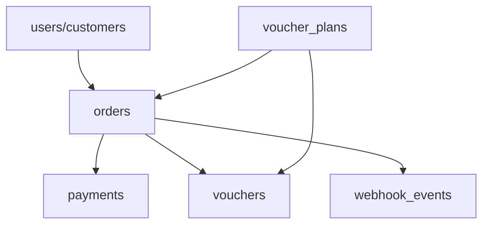

# Wi-Fi Voucher System

This workspace contains a production-oriented Wi-Fi voucher purchasing backend with a simple frontend and PayMongo-ready flow.

## Architecture

The application is structured around three layers:

- Frontend: static HTML/CSS/JS files under [public](public)
- API layer: Express routes/controllers in [src/routes](src/routes) and [src/controllers](src/controllers)
- Core business logic: MySQL/database access and payment/voucher services in [src/services](src/services)

## Database relationship overview



## Key files

- [src/app.js](src/app.js) — Express app bootstrap and middleware
- [src/server.js](src/server.js) — HTTP server entrypoint
- [src/services/paymongo.service.js](src/services/paymongo.service.js) — PayMongo payment intent and webhook helpers
- [src/services/voucher.service.js](src/services/voucher.service.js) — secure voucher code generation and validation
- [src/routes/order.routes.js](src/routes/order.routes.js) — order creation and order status endpoints
- [src/routes/webhook.routes.js](src/routes/webhook.routes.js) — PayMongo webhook endpoint
- [database/schema.sql](database/schema.sql) — MySQL schema
- [public/payment.html](public/payment.html) — payment page UI

## Install

```bash
npm install
```

## Setup environment

Copy [.env.example](.env.example) to `.env` and fill the database and PayMongo values.

## Local development

```bash
npm run dev
```

Then open the app at http://localhost:3000.

## MySQL

```sql
CREATE DATABASE IF NOT EXISTS wifi_voucher CHARACTER SET utf8mb4 COLLATE utf8mb4_unicode_ci;
```

Then import:

```bash
mysql -u root -p wifi_voucher < database/schema.sql
mysql -u root -p wifi_voucher < database/seed.sql
```

## Production notes

- Run behind Nginx and TLS/Let’s Encrypt.
- Do not expose the Node.js port directly.
- Keep all PayMongo secrets in the environment file only.
- Use the PayMongo webhook secret to validate incoming requests.
- Treat the webhook as the source of truth for payment success.

## Verification

This workspace was verified with:

```bash
node --test
```

The test run passed with four passing assertions, including voucher code generation and validation checks.
